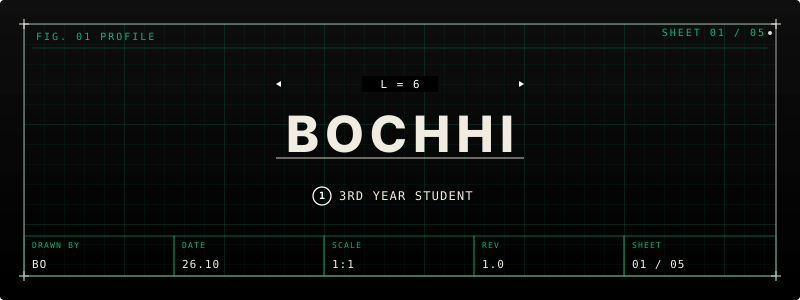

<div align="center">

<!-- Animated Banner -->


<br/>

<!-- Typing SVG -->


<br/>

<!-- Bocchi GIF -->
<!--  -->
</div>

---

## `About`

```ts
const bocchi = {
  name     : "Saurabh Bisht",
  alias    : "bocchi277",
  year     : "2nd Year @ Sitare University",
  focus    : ["Web Development", "UI/UX Design"],
  learning : ["Flask", "MongoDB", "Three.js"],
  vibe     : "quiet soul • solitude"
};
```

---

## `Tech Stack`

<div align="center">

<!-- Frontend -->


<!-- Backend -->


<!-- Learning -->


<!-- Tools -->


</div>

---

## `Projects`

<div align="center">

| 🔗 Project | 📄 Description | 🏷️ Tag |
|:-----------|:---------------|:-------|
| 🎓 Portfolio *(coming soon)* | Personal portfolio website | `in-progress` |
| [**Eduport**](https://eduporttt.netlify.app) | Full stack web application | `fullstack` |
| [**Stack Overflow Analyzer**](https://data-analyzerrr.netlify.app/) | Visualizes SO data trends from 2023–25 | `data` |
| [**Medsphere**](https://medsphere.netlify.app/) | Healthcare hackathon project | `hackathon` |
| [**ACM Website**](https://acm-277.netlify.app/) | Club site built during hackathon | `hackathon` |
| [**Medicine Analyzer**](https://medicineanalyzer.netlify.app/) | College project for medicine info | `college` |

</div>

---
<div align="center">
  
</div>
---

## `Connect`

<div align="center">

<a href="https://www.linkedin.com/in/saurabh-bisht-313301316/" target="_blank">
  
</a>
&nbsp;
<a href="mailto:astra277353@gmail.com">
  
</a>

<br/><br/>

*"Despite everything, its still you."*

</div>

---


